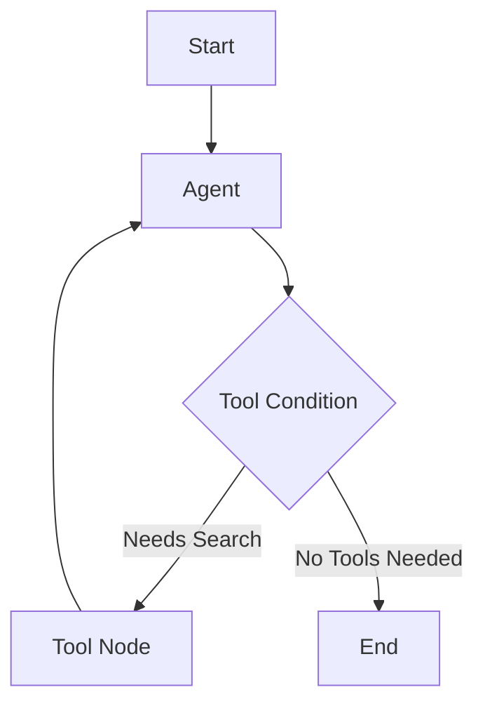

# AI Agent Simple

A simple example of an AI agent that can understand natural language queries about planet masses and perform calculations in scientific notation, with additional support for real-time web search using LangChain and LangGraph.

## Features

### Planet Mass Calculations
- Calculate combined masses of multiple planets
- Handle scientific notation (e.g., 1.898e24)
- Interactive command-line interface
- Comprehensive test suite

### Available Planets
- Earth (5.972e24 kg)
- Mars (6.4171e24 kg)
- Jupiter (1.898e24 kg)
- Saturn (5.688e24 kg)

### LangGraph Integration
A new integration using LangChain's ChatOpenAI model with tool support:

```python
def simple_agent_langgraph(state: MessagesState):
    messages = state["messages"]
    return {"messages": [model_with_tools.invoke(messages)]}
```

#### Tool Usage
The agent has access to the Tavily search tool for real-time information retrieval:

- Simple queries (answered directly):
  - "What's 2+2?"
  - "Who was Albert Einstein?"

- Complex queries (uses search tool):
  - "Find a hotel near Manhattan in New York"
  - "What are the latest developments in AI?"

#### Graph Agent Architecture


## Installation

```bash
# Clone the repository
git clone https://github.com/lenaar/ai-agent-simple.git
cd ai-agent-simple

# Install dependencies
pip install -r requirements.txt
```

### API Keys
Create a `.env` file with:
- `OPENAI_API_KEY`: For ChatGPT model access
- `TAVILY_API_KEY`: For web search functionality (only needed for search features)

## Usage

### Starting the Chat

1. Run the main application:
```bash
python main.py
```

2. Select the agent type when prompted:
```
Enter agent type (simple_agent or simple_agent_langgraph): simple_agent_langgraph
```

3. Start chatting:
```
Your question (or 'quit' to exit): find a hotel near Manhatten in New York
```

### Agent Types

#### simple_agent
For planet mass calculations. Example questions:
- "What is the combined mass of Jupiter and Saturn?"
- "What is the combined mass of Earth, Mars, and Jupiter?"

#### simple_agent_langgraph
For web search and real-time information. Example questions:
- "Find a hotel near Manhattan in New York"
- "What are the latest developments in AI?"
- "What's the current weather in Tokyo?"

### Programmatic Usage

You can also use the agents programmatically:

```python
# For planet mass calculations
from simple_agent import SimpleAgent
agent = SimpleAgent()
response = agent.run("What is the mass of Jupiter?")

# For web search queries
from langgraph_agent import build_graph_agent
agent = build_graph_agent()
response = agent.invoke({
    "messages": [{
        "role": "user", 
        "content": "Find me a hotel in Manhattan"
    }]
})
```

### Tips
- Use clear, specific questions
- For web searches, provide enough context
- Type 'exit' or 'quit' to end the chat
- Use 'help' to see available commands

## Testing

```bash
python -m pytest tests/ -v
```

## Implementation Details

### Core Files
- `simple_agent.py`: Original agent implementation for planet calculations
- `simple_agent_tools.py`: Tools for calculations and planet mass lookup
- `simple_agent_query.py`: Query processing and skill execution
- `simple_agent_prompt.py`: System prompt and examples

### LangGraph Integration
- `langgraph_agent.py`: Graph-based agent implementation
- `langgraph_agent_tools.py`: Tool definitions (Tavily search)

## Recent Updates

### Planet Mass Features
- Added support for calculating masses of any number of planets
- Improved scientific notation handling
- Enhanced error handling for unknown planets

### LangGraph Features
- Integrated LangGraph for better tool handling
- Added Tavily search for real-time information
- Improved message routing with tool conditions